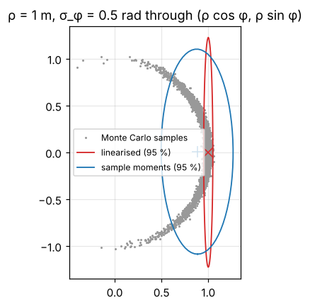
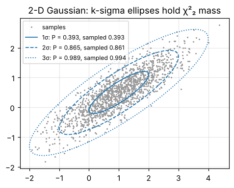

# 1 · Probability for robotics

A robot never knows its state exactly. Wheels slip, sensors are noisy, maps are approximate. State estimation
replaces "the robot is at $x$" with "the robot is at $x$ with this probability", and the rest of the module is
about computing that probability efficiently. This chapter collects the tools every later chapter uses:
Gaussians, how they move through functions, Bayes' rule, and the Mahalanobis distance.

Code: [`gaussian.hpp`](../cpp/include/state_estimation/gaussian.hpp) ·
Tests: [`test_gaussian.cpp`](../cpp/tests/test_gaussian.cpp) ·
Notebook: [`01_probability.ipynb`](../2_notebooks/solutions/01_probability.ipynb)

## 1.1 Random vectors, mean and covariance

A random vector $x \in \mathbb R^n$ with density $p(x)$ has mean and covariance

$$
\mu = E[x] = \int x\, p(x)\, dx \tag{1.1}
$$

$$
\Sigma = \operatorname{Cov}[x] = E\big[(x-\mu)(x-\mu)^T\big]. \tag{1.2}
$$

$\Sigma$ is symmetric and positive semi-definite: for any direction $a$, $a^T\Sigma a = \operatorname{Var}[a^Tx]
\ge 0$. Its diagonal holds the variances of the components; the off-diagonal terms are their covariances.
A non-zero off-diagonal term means that learning one component tells you something about the other — this is
exactly what makes SLAM (chapter 9) work.

## 1.2 The Gaussian

The scalar Gaussian with mean $\mu$ and variance $\sigma^2$ is

$$
\mathcal N(x;\mu,\sigma^2) = \frac{1}{\sqrt{2\pi\sigma^2}} \exp\!\Big(-\frac{(x-\mu)^2}{2\sigma^2}\Big), \tag{1.3}
$$

and in $n$ dimensions

$$
\mathcal N(x;\mu,\Sigma) = \frac{1}{\sqrt{(2\pi)^n \lvert\Sigma\rvert}}
\exp\!\Big(-\tfrac12 (x-\mu)^T\Sigma^{-1}(x-\mu)\Big). \tag{1.4}
$$

Gaussians dominate estimation for three reasons: they are fully described by two moments; a linear function of
a Gaussian is Gaussian (§1.3); and the product of two Gaussian densities is again Gaussian (§1.7). The Kalman
filter (chapter 5) is nothing more than these two facts applied in a loop.

**Numerics.** Never form $\Sigma^{-1}$ explicitly. With the Cholesky factor $\Sigma = LL^T$,
solve $Ly = x-\mu$; then $(x-\mu)^T\Sigma^{-1}(x-\mu) = y^Ty$ and $\log\lvert\Sigma\rvert = 2\sum_i \log L_{ii}$.
Work with $\log \mathcal N$: in 30 dimensions the density itself under- or overflows easily.

## 1.3 Linear transformations

Let $y = Ax + b$. Linearity of expectation gives

$$
E[y] = A\,E[x] + b \tag{1.5}
$$

and, substituting in (1.2),

$$
\operatorname{Cov}[y] = E\big[A(x-\mu)(x-\mu)^TA^T\big] = A\Sigma A^T. \tag{1.6}
$$

Both hold for *any* distribution. For a Gaussian the result is again Gaussian, so the transformation is exact:

$$
x \sim \mathcal N(\mu, \Sigma) \;\Rightarrow\; Ax+b \sim \mathcal N(A\mu + b,\; A\Sigma A^T). \tag{1.7}
$$

A special case used everywhere: if $x$ and $w$ are independent, $y = x + w$ has covariance
$\Sigma_x + \Sigma_w$ (take $A = [I\;\, I]$ acting on the stacked vector $[x^T\, w^T]^T$, whose covariance is block
diagonal). Uncertainties of independent errors **add as covariances**, not as standard deviations.

## 1.4 Nonlinear transformations and linearisation

Robots rotate, so their models contain $\sin$ and $\cos$, and $y = f(x)$ is nonlinear. The image of a Gaussian
is then not Gaussian. The first-order Taylor expansion about the mean,

$$
f(x) \approx f(\mu) + J\,(x-\mu), \qquad J = \frac{\partial f}{\partial x}\Big\rvert_{x=\mu}, \tag{1.8}
$$

is affine in $x$, so (1.7) applies to it:

$$
y \;\dot\sim\; \mathcal N\big(f(\mu),\; J\Sigma J^T\big). \tag{1.9}
$$

This is the propagation used by the extended Kalman filter (chapter 6). It is accurate when $f$ is close to
linear over the region where $p(x)$ has mass — roughly, over a few standard deviations. The error has two
parts: the mean is biased because $E[f(x)] \neq f(E[x])$, and the covariance ignores second-order terms.

**Example — polar to Cartesian.** A range–bearing sensor returns $(\rho, \phi)$; the point is

$$
f(\rho,\phi) = \begin{bmatrix}\rho\cos\phi\\ \rho\sin\phi\end{bmatrix}, \tag{1.10}
$$

$$
J = \begin{bmatrix}\cos\phi & -\rho\sin\phi\\ \sin\phi & \rho\cos\phi\end{bmatrix}. \tag{1.11}
$$

With exact range and
bearing $\phi \sim \mathcal N(0, \sigma_\phi^2)$, the true mean is $E[\rho\cos\phi] = \rho\, e^{-\sigma_\phi^2/2}$
(the characteristic function of a Gaussian), while (1.9) predicts $\rho$. With $\sigma_\phi = 0.5$ rad the
true mean lies at $0.8825\,\rho$: the linearised mean is outside most of the samples, which form a "banana".
The notebook reproduces this, and the figure below shows it.

## 1.5 Bayes' rule

For a state $x$ and a measurement $z$,

$$
p(x \mid z) = \frac{p(z \mid x)\, p(x)}{p(z)}, \qquad p(z) = \sum_x p(z\mid x)p(x)\ \text{ or }\ \int p(z\mid x)p(x)\,dx. \tag{1.12}
$$

$p(x)$ is the **prior**, $p(z\mid x)$ the **likelihood** (a *function of $x$* for the measured $z$, not a
density in $x$), and $p(x\mid z)$ the **posterior**. The evidence $p(z)$ does not depend on $x$, so one writes

$$
p(x \mid z) = \eta\, p(z \mid x)\, p(x), \tag{1.13}
$$

and finds $\eta$ by normalising. Every filter in this module is a recursive application of (1.13).

**Worked example (door sensor, after Thrun et al., §2.4).** A door is open or closed with prior $0.5$ each.
A sensor reports "open" with probability $0.6$ when the door is open and $0.3$ when it is closed. After one
"open" reading,

$$
p(\text{open}\mid z) = \frac{0.6\cdot 0.5}{0.6\cdot0.5 + 0.3\cdot0.5} = \frac{0.30}{0.45} = 0.6667.
$$

A weak sensor still moves the belief; a second independent "open" reading moves it to $0.8$
(prior $0.6667$, same likelihoods). Both numbers are checked in the tests.

## 1.6 Mahalanobis distance and the chi-square distribution

The exponent of (1.4) defines the squared **Mahalanobis distance**

$$
d^2_M(x) = (x-\mu)^T\Sigma^{-1}(x-\mu). \tag{1.14}
$$

It measures distance in units of standard deviation along each principal direction, so a point $1$ m away
along a direction with $\sigma = 0.1$ m is "far" ($d_M = 10$), and the same point along a direction with
$\sigma = 10$ m is "near" ($d_M = 0.1$).

**Its distribution.** Write $\Sigma = LL^T$ and $z = L^{-1}(x-\mu)$. By (1.7), $z \sim \mathcal N(0, I_n)$ and
$d^2_M = z^Tz = \sum_i z_i^2$, a sum of $n$ squared independent standard normals. That is the definition of
the chi-square distribution with $n$ degrees of freedom:

$$
d^2_M \sim \chi^2_n, \qquad P(d^2_M \le q) = P\big(\tfrac n2, \tfrac q2\big), \tag{1.15}
$$

where $P(a, x)$ is the regularised lower incomplete gamma function. Two consequences used later:

- **Gating** (chapter 8). A measurement is compatible with a prediction if $d^2_M \le \chi^2_n(1-\alpha)$; with
  $\alpha = 0.05$ the gate is $3.841$ for $n=1$ and $5.991$ for $n=2$.
- **Consistency** (chapter 5). If a filter's covariance is honest, the normalised error $d^2_M$ of its estimate
  must average $n$; values far above signal an over-confident filter.

**How much mass is inside "one sigma"?** In 1-D, $P(\lvert x-\mu\rvert\le\sigma) = 0.6827$. In 2-D the same
"one-sigma" ellipse $d^2_M \le 1$ holds only $1 - e^{-1/2} = 0.3935$ of the mass, and the two-sigma ellipse
$0.8647$. Drawing "1-σ ellipses" in a plot and expecting two thirds of the points inside is a classic mistake.

## 1.7 Sampling and plotting

**Sampling.** To draw $x \sim \mathcal N(\mu, \Sigma)$, draw $z \sim \mathcal N(0, I_n)$ and set

$$
x = \mu + Lz, \qquad \Sigma = LL^T. \tag{1.16}
$$

By (1.6), $\operatorname{Cov}[x] = LIL^T = \Sigma$. Any square root works; Cholesky is the cheapest. If
$\Sigma$ is only semi-definite (e.g. a perfectly known heading), use the eigendecomposition
$\Sigma = U\Lambda U^T$ and $L = U\Lambda^{1/2}$.

**The confidence ellipse.** The set $d^2_M \le q$ for a 2-D Gaussian is an ellipse. With
$\Sigma = U\Lambda U^T$, $\Lambda = \operatorname{diag}(\lambda_1, \lambda_2)$, $\lambda_1 \ge \lambda_2$,

$$
\text{semi-axes } \sqrt{q\lambda_1},\ \sqrt{q\lambda_2},\quad \text{major axis along } u_1, \quad
q = \chi^2_2(p) = -2\ln(1-p). \tag{1.17}
$$

## 1.8 Fusing two Gaussian estimates

Two independent estimates of the same quantity, $\mathcal N(\mu_a, \Sigma_a)$ and $\mathcal N(\mu_b, \Sigma_b)$,
combine by Bayes' rule: one is the prior, the other the likelihood. The product of the two densities has
exponent $-\frac12[(x-\mu_a)^T\Sigma_a^{-1}(x-\mu_a) + (x-\mu_b)^T\Sigma_b^{-1}(x-\mu_b)]$, a quadratic in $x$.
Collecting the quadratic and linear terms (completing the square) gives a Gaussian with

$$
\Sigma^{-1}\;\; = \Sigma_a^{-1} + \Sigma_b^{-1} \tag{1.18}
$$

$$
\Sigma^{-1}\mu = \Sigma_a^{-1}\mu_a + \Sigma_b^{-1}\mu_b. \tag{1.19}
$$

Information (inverse covariance) adds. Using the matrix inversion lemma, the same result reads

$$
K = \Sigma_a(\Sigma_a + \Sigma_b)^{-1},\qquad \mu = \mu_a + K(\mu_b - \mu_a),\qquad \Sigma = (I-K)\Sigma_a, \tag{1.20}
$$

which needs one inversion of $\Sigma_a + \Sigma_b$ only and already has the shape of the Kalman update: a
**gain** $K$ times a **difference** between what we believed and what we measured.

**Worked example.** $\mathcal N(10, 4)$ fused with $\mathcal N(12, 1)$: $K = 4/5$, $\mu = 10 + 0.8\cdot 2
= 11.6$, $\sigma^2 = 0.2 \cdot 4 = 0.8$. The result is closer to the more certain estimate and more certain
than either input.

## Algorithm summary

1. Represent belief as $(\mu, \Sigma)$; keep $\Sigma$ symmetric positive definite.
2. Linear map: $\mu \leftarrow A\mu+b$, $\Sigma \leftarrow A\Sigma A^T$ (exact).
3. Nonlinear map: $\mu \leftarrow f(\mu)$, $\Sigma \leftarrow J\Sigma J^T$ with $J$ at the mean (approximate).
4. New information: multiply by the likelihood and renormalise (Bayes); for two Gaussians use (1.20).
5. Test compatibility with $d^2_M$ against $\chi^2_n(1-\alpha)$.

## Common mistakes

- Adding standard deviations instead of variances when combining independent errors.
- Reading a 2-D "1σ ellipse" as a 68 % region (it is 39 %).
- Computing $\Sigma^{-1}$ explicitly, or evaluating the density instead of its logarithm.
- Treating the likelihood $p(z\mid x)$ as a density over $x$ (it need not integrate to one in $x$).
- Trusting (1.9) when the nonlinearity is strong over the spread of $x$: the bearing uncertainty of a
  distant landmark is the standard case.
- Letting a covariance lose symmetry through round-off; symmetrise with $\frac12(\Sigma + \Sigma^T)$ after updates.

## References

- S. Thrun, W. Burgard, D. Fox, *Probabilistic Robotics*, MIT Press, 2005 — ch. 2 (Bayes' rule, the door example), ch. 3.
- Y. Bar-Shalom, X. R. Li, T. Kirubarajan, *Estimation with Applications to Tracking and Navigation*, Wiley, 2001 — ch. 1–2.
- R. Smith, M. Self, P. Cheeseman, "Estimating uncertain spatial relationships in robotics", *Autonomous Robot Vehicles*, Springer, 1990.
- W. H. Press et al., *Numerical Recipes*, 3rd ed., CUP, 2007 — §6.2 (incomplete gamma function).
