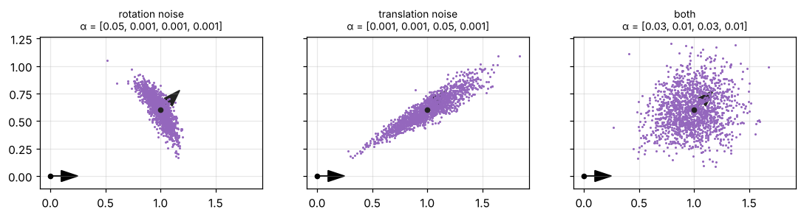
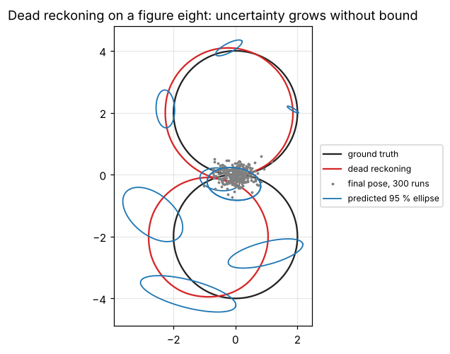

# 2 · Motion models

A motion model answers: *if the robot was at $x_{k-1}$ and executed (or measured) $u_k$, where is it now, and how
sure are we?* Deterministically this is kinematics; probabilistically it is the density
$p(x_k \mid x_{k-1}, u_k)$ that every filter in this module uses in its prediction step. This chapter builds
the motion models of a differential-drive robot from the algebra of planar poses, then shows how integrating
them alone — dead reckoning — drifts without bound.

Code: [`pose2.hpp`](../cpp/include/state_estimation/pose2.hpp),
[`motion_models.hpp`](../cpp/include/state_estimation/motion_models.hpp),
[`simulation.hpp`](../cpp/include/state_estimation/simulation.hpp) ·
Tests: [`test_motion_models.cpp`](../cpp/tests/test_motion_models.cpp) ·
Notebook: [`02_motion_models.ipynb`](../2_notebooks/solutions/02_motion_models.ipynb)

## 2.1 Planar poses and compounding

A planar pose $x = [x\;\,y\;\,\theta]^T$ locates a frame (the robot) in a reference frame (the world): its
origin is at $(x, y)$ and its $x$-axis points at angle $\theta$. Following Smith, Self and Cheeseman, two
operations are enough for everything that follows.

**Compounding.** If $b$ is a pose expressed in the frame $a$, then $a \oplus b$ is the same pose expressed in
the frame that $a$ is expressed in. With $c = \cos\theta_a$, $s = \sin\theta_a$:

$$
a \oplus b = \begin{bmatrix} x_a + c\,x_b - s\,y_b \\ y_a + s\,x_b + c\,y_b \\ \theta_a + \theta_b \end{bmatrix}. \tag{2.1}
$$

It is the product of homogeneous transforms $T(a)T(b)$ written in coordinates, so it is associative but not
commutative. Its Jacobians with respect to each argument are

$$
J_{1\oplus} = \frac{\partial (a\oplus b)}{\partial a} =
\begin{bmatrix} 1 & 0 & -s\,x_b - c\,y_b \\ 0 & 1 & c\,x_b - s\,y_b \\ 0 & 0 & 1 \end{bmatrix}, \tag{2.2}
$$

$$
J_{2\oplus} = \frac{\partial (a\oplus b)}{\partial b} =
\begin{bmatrix} c & -s & 0 \\ s & c & 0 \\ 0 & 0 & 1 \end{bmatrix}. \tag{2.3}
$$

The third column of $J_{1\oplus}$ is the lever arm: an error in the heading of $a$ moves the end point $b$
sideways by an amount proportional to its distance from $a$.

**Inversion.** $\ominus a$ is the pose of the reference frame seen from $a$, so that
$a \oplus (\ominus a) = (\ominus a) \oplus a = 0$:

$$
\ominus a = \begin{bmatrix} -c\,x_a - s\,y_a \\ s\,x_a - c\,y_a \\ -\theta_a \end{bmatrix},
\qquad
J_\ominus = \begin{bmatrix} -c & -s & s\,x_a - c\,y_a \\ s & -c & c\,x_a + s\,y_a \\ 0 & 0 & -1 \end{bmatrix}. \tag{2.4–2.5}
$$

The relative pose of $b$ seen from $a$ is $(\ominus a) \oplus b$.

**Points.** A point $p$ measured in the robot frame is at

$$
x \boxplus p = \begin{bmatrix}x\\y\end{bmatrix} + R(\theta)\,p \tag{2.6}
$$

in the world frame, with Jacobians

$$
\frac{\partial (x\boxplus p)}{\partial x} = \begin{bmatrix} 1 & 0 & -s\,p_x - c\,p_y \\ 0 & 1 & c\,p_x - s\,p_y \end{bmatrix},
\qquad \frac{\partial (x\boxplus p)}{\partial p} = R(\theta). \tag{2.7}
$$

**Worked example.** The robot is at $a = (2, 1, \pi/2)$. A pose $b = (1, 0.5, \pi/2)$ in its frame (1 m ahead,
0.5 m to the left, turned left) is at $a \oplus b = (1.5, 2, \pi)$ in the world, and $\ominus a = (-1, 2, -\pi/2)$.
Both are checked in the tests against products of homogeneous matrices. Angles are always wrapped to
$(-\pi, \pi]$ after a sum.

## 2.2 Differential-drive kinematics

Two wheels of radius $r$ on a common axle of length $b$ (the wheel base) turn at angular rates
$\omega_l, \omega_r$. The wheel centres move at $r\omega_l$ and $r\omega_r$; the robot centre moves at their
average and the robot turns at their difference over the base:

$$
v = \frac{r(\omega_r + \omega_l)}{2}, \qquad \omega = \frac{r(\omega_r - \omega_l)}{b}. \tag{2.8}
$$

The robot cannot move sideways (non-holonomic constraint $\dot x\sin\theta - \dot y\cos\theta = 0$).
Over one sample, encoders measure how far each wheel rolled, $d_l$ and $d_r$ (for $\Delta n$ ticks of an encoder
with $N$ ticks per revolution, $d = 2\pi r\,\Delta n/N$). Integrating (2.8) over the sample gives the arc length
and the heading change:

$$
s = \frac{d_r + d_l}{2}, \qquad \varphi = \frac{d_r - d_l}{b}. \tag{2.9}
$$

If both wheels keep a constant speed during the sample the robot drives a circular arc. Equation (2.9) only
assumes that the *ratio* of the wheel speeds is constant — a much weaker assumption than constant velocity —
which is why encoder odometry is usually better than integrating commanded velocities.

## 2.3 The arc displacement

In the robot frame at the start of the sample, the unicycle $\dot x = v\cos\theta$, $\dot y = v\sin\theta$,
$\dot\theta = \omega$ with constant $v, \omega$ and $\theta(0) = 0$ integrates to
$x(t) = \frac{v}{\omega}\sin\omega t$, $y(t) = \frac{v}{\omega}(1-\cos\omega t)$. Substituting $s = vt$ and
$\varphi = \omega t$:

$$
\delta(s,\varphi) = \begin{bmatrix} s\,\dfrac{\sin\varphi}{\varphi} \\[2mm] s\,\dfrac{1-\cos\varphi}{\varphi} \\[2mm] \varphi\end{bmatrix}
\;\xrightarrow{\;\varphi\to 0\;}\; \begin{bmatrix} s \\ 0 \\ 0\end{bmatrix}. \tag{2.10–2.11}
$$

Its Jacobian with respect to $(s, \varphi)$ is

$$
\frac{\partial\delta}{\partial(s,\varphi)} = \begin{bmatrix} \frac{\sin\varphi}{\varphi} & s\,\frac{\varphi\cos\varphi - \sin\varphi}{\varphi^2} \\
\frac{1-\cos\varphi}{\varphi} & s\,\frac{\varphi\sin\varphi - (1-\cos\varphi)}{\varphi^2} \\ 0 & 1\end{bmatrix}. \tag{2.12}
$$

Both expressions are $0/0$ at $\varphi = 0$; the code switches to their Taylor series
($\sin\varphi/\varphi \approx 1 - \varphi^2/6$, $(1-\cos\varphi)/\varphi \approx \varphi/2 - \varphi^3/24$) for
$\lvert\varphi\rvert < 10^{-4}$. The tests check the series against the closed form at the switch point.

## 2.4 The velocity motion model

With controls $(v, \omega)$ held for $\Delta t$, the new pose is the old one compounded with the arc:

$$
x_k = f(x_{k-1}, u_k) = x_{k-1} \oplus \delta(v\Delta t,\ \omega\Delta t). \tag{2.13}
$$

Writing the model as a compounding makes its Jacobians a product of the pieces above:
$F = J_{1\oplus}$ and $\partial f/\partial u = J_{2\oplus}\,\frac{\partial\delta}{\partial(s,\varphi)}\,\Delta t$.
A full circle ($\omega\Delta t = 2\pi$) returns exactly to the start; the tests also compare (2.13) with fine
Euler integration.

**The probabilistic model** (Thrun et al., §5.3). The executed velocities differ from the commanded ones by
noise whose variance grows with the motion:

$$
\hat v = v + \varepsilon_{\alpha_1 v^2 + \alpha_2\omega^2},\quad
\hat\omega = \omega + \varepsilon_{\alpha_3 v^2 + \alpha_4\omega^2},\quad
\hat\gamma = \varepsilon_{\alpha_5 v^2 + \alpha_6\omega^2}, \tag{2.14}
$$

where $\varepsilon_{\sigma^2}$ is zero-mean noise with variance $\sigma^2$. The pose is (2.13) with
$(\hat v, \hat\omega)$, followed by a final rotation $\hat\gamma\Delta t$. Without $\hat\gamma$ the model would be
degenerate: two noisy numbers cannot spread a 3-D pose, and every sample would lie on a 2-D surface.

## 2.5 The odometry motion model

Most robots do not report velocities but an internal odometry pose $\bar x$, itself integrated from the
encoders. The motion between two odometry poses $\bar x_{k-1}, \bar x_k$ is decomposed into a rotation, a
translation and a second rotation (Thrun et al., §5.4):

$$
\delta_\text{rot1} = \operatorname{atan2}(\bar y_k - \bar y_{k-1},\ \bar x_k - \bar x_{k-1}) - \bar\theta_{k-1},\quad
\delta_\text{trans} = \lVert \bar p_k - \bar p_{k-1}\rVert,\quad
\delta_\text{rot2} = \bar\theta_k - \bar\theta_{k-1} - \delta_\text{rot1}. \tag{2.15}
$$

The increment is applied to the robot's own pose estimate,

$$
x_k = \begin{bmatrix} x + \delta_\text{trans}\cos(\theta + \delta_\text{rot1}) \\ y + \delta_\text{trans}\sin(\theta + \delta_\text{rot1}) \\
\theta + \delta_\text{rot1} + \delta_\text{rot2}\end{bmatrix}, \tag{2.16}
$$

which is why the model is independent of the odometry frame's drift: only *differences* of odometry poses
are used. Each of the three components is corrupted independently:

$$
\sigma^2_\text{rot1} = \alpha_1\delta_\text{rot1}^2 + \alpha_2\delta_\text{trans}^2,\quad
\sigma^2_\text{trans} = \alpha_3\delta_\text{trans}^2 + \alpha_4(\delta_\text{rot1}^2 + \delta_\text{rot2}^2),\quad
\sigma^2_\text{rot2} = \alpha_1\delta_\text{rot2}^2 + \alpha_2\delta_\text{trans}^2. \tag{2.17}
$$

Sampling draws the three perturbed components and applies (2.16). Evaluating the density of a hypothesised
$x_k$ given $x_{k-1}$ inverts the decomposition — compute $(\delta_\text{rot1}, \delta_\text{trans},
\delta_\text{rot2})$ between $x_{k-1}$ and $x_k$ with (2.15) — and multiplies three scalar densities:

$$
p(x_k \mid x_{k-1}, u_k) = \prod_{j\in\{\text{rot1},\text{trans},\text{rot2}\}} \mathcal N\big(\operatorname{wrap}(\delta_j^{u} - \delta_j^{x});\ 0,\ \sigma_j^2\big). \tag{2.18}
$$

Sampling is what a particle filter needs (chapter 7); the density is what a grid filter needs (chapter 4).
Samples of this model form the familiar banana: a heading error at the start of the motion moves the end point
along an arc.

**Which model?** Use the odometry model whenever odometry is available: it is measured after the fact and
typically more accurate than commanded velocities. Use the velocity model for planning, or when only the
commands are known. A filter that *predicts* with odometry treats it as a control input, not as a measurement.

## 2.6 Dead reckoning and its drift

Dead reckoning integrates the displacement $u_k = \delta(s_k, \varphi_k)$ measured by the encoders,

$$
\hat x_k = \hat x_{k-1} \oplus u_k, \tag{2.19}
$$

and, if $u_k \sim \mathcal N(\hat u_k, Q_k)$ is independent of $\hat x_{k-1} \sim \mathcal N(\hat x_{k-1}, P_{k-1})$,
linearised propagation (1.9) of the compounding gives

$$
P_k = J_{1\oplus} P_{k-1} J_{1\oplus}^T + J_{2\oplus} Q_k J_{2\oplus}^T. \tag{2.20}
$$

The displacement covariance comes from the encoder noise. With independent wheel errors of variance
$\sigma_l^2, \sigma_r^2$ (proportional to the distance rolled, $\sigma^2 = k\lvert d\rvert$, plus $\Delta^2/12$
for a quantisation step $\Delta$),

$$
Q_k = G\,\operatorname{diag}(\sigma_l^2, \sigma_r^2)\,G^T, \qquad
G = \frac{\partial\delta}{\partial(s,\varphi)} \begin{bmatrix} 1/2 & 1/2 \\ -1/b & 1/b\end{bmatrix}. \tag{2.21}
$$

$Q_k$ has rank two — the robot cannot slip sideways in this model — but $P_k$ becomes full rank after a turn.

**How fast does it drift?** Drive straight in $n$ steps of length $s$, with only heading noise of variance
$\sigma^2$ per step. The heading error after step $i$ is $\theta_i = \sum_{j\le i}\varepsilon_j$, a random walk
with $\operatorname{Var}[\theta_i] = i\sigma^2$. The lateral error is accumulated with the heading *before*
each step: $y_n \approx s\sum_{i=0}^{n-1}\theta_i = s\sum_{j=1}^{n-1}(n-j)\varepsilon_j$, so

$$
\operatorname{Var}[y_n] = s^2\sigma^2\sum_{m=1}^{n-1} m^2 = s^2\sigma^2\,\frac{(n-1)\,n\,(2n-1)}{6} \;\approx\; \frac{s^2\sigma^2 n^3}{3}. \tag{2.22}
$$

Heading uncertainty grows like $\sqrt n$; position uncertainty like $n^{3/2}$, i.e. with distance travelled to
the power $3/2$. Equation (2.20) reproduces (2.22) exactly (it is checked in the tests), and no tuning of the
noise model changes the exponent: **dead reckoning alone always diverges**. Chapters 5–9 bound this growth with
measurements of the outside world.

**What the covariance does not cover.** Equation (2.20) is first-order. When the heading uncertainty reaches
tenths of a radian the cloud of possible positions bends into a banana that no ellipse describes: its mean moves
away from the noise-free end point and the predicted 95 % ellipse no longer holds 95 % of the runs (the notebook
measures it). Worse, *systematic* errors
— a wheel radius or wheel base that is off by 1 % — are not random at all: they bend every trajectory the same
way, and no covariance describes them. They must be removed by calibration (Borenstein's UMBmark), not by
filtering.

## Algorithm summary — dead reckoning from encoders

1. Read the tick increments of both wheels; convert to $d_l$, $d_r$.
2. $s = (d_r+d_l)/2$, $\varphi = (d_r - d_l)/b$; displacement $u = \delta(s, \varphi)$ by (2.11).
3. Displacement covariance $Q$ by (2.21).
4. Jacobians $J_{1\oplus}(\hat x_{k-1}, u)$, $J_{2\oplus}(\hat x_{k-1}, u)$ **at the old pose**.
5. $\hat x_k = \hat x_{k-1}\oplus u$ (wrap the angle), $P_k$ by (2.20), symmetrise.

## Common mistakes

- Evaluating the Jacobians after overwriting the mean (step 4 before step 5).
- Forgetting to wrap angles after compounding, or computing a heading difference without wrapping.
- Using $\operatorname{atan2}$ of a zero translation in the odometry model: a robot turning on the spot gets a
  random $\delta_\text{rot1}$. Put the whole turn in one rotation instead.
- Dropping the final rotation $\hat\gamma$ of the velocity model, which makes the samples degenerate.
- Treating odometry as a measurement of the pose (it is relative, and its errors accumulate).
- Expecting the covariance to cover a mis-calibrated wheel base.

## References

- S. Thrun, W. Burgard, D. Fox, *Probabilistic Robotics*, MIT Press, 2005 — ch. 5 (tables 5.3, 5.5, 5.6).
- R. Siegwart, I. Nourbakhsh, D. Scaramuzza, *Introduction to Autonomous Mobile Robots*, 2nd ed., MIT Press,
  2011 — §3.2 (kinematics), §5.2.4 (odometric error propagation).
- R. Smith, M. Self, P. Cheeseman, "Estimating uncertain spatial relationships in robotics", 1990 — compounding
  and inversion.
- J. Borenstein, L. Feng, "Measurement and correction of systematic odometry errors in mobile robots",
  *IEEE Trans. Robotics and Automation* 12(6), 1996.
