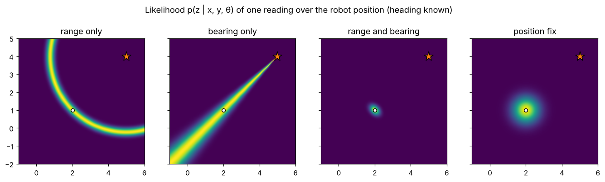

# 3 · Measurement models

Motion makes the robot less certain; measurements of the outside world make it more certain again. A
measurement model $z = h(x) + v$ predicts what a sensor would read from a hypothesised state, and its
likelihood $p(z \mid x)$ scores how well a hypothesis explains what was actually read. This chapter derives the
models for the three sensor types used in the rest of the module — range–bearing observations of point
landmarks, the same landmarks observed in Cartesian coordinates, and absolute position fixes — together with
their Jacobians and inverses, and asks which parts of the state each one can observe.

Code: [`measurement_models.hpp`](../cpp/include/state_estimation/measurement_models.hpp) ·
Tests: [`test_measurement_models.cpp`](../cpp/tests/test_measurement_models.cpp) ·
Notebook: [`03_measurement_models.ipynb`](../2_notebooks/solutions/03_measurement_models.ipynb)

## 3.1 Measurement models and likelihoods

A sensor returns $z_k$; the model says how $z_k$ depends on the state and on noise:

$$
z_k = h(x_k) + v_k, \qquad v_k \sim \mathcal N(0, R_k). \tag{3.1}
$$

For a fixed reading, the **likelihood** of a state hypothesis is

$$
p(z_k \mid x_k) = \mathcal N\big(z_k;\ h(x_k),\ R_k\big)
= \frac{1}{\sqrt{(2\pi)^m\lvert R_k\rvert}}\exp\!\Big(-\tfrac12\,\nu^T R_k^{-1}\nu\Big),\quad \nu = z_k - h(x_k). \tag{3.2}
$$

When the components of $\nu$ include angles, they are wrapped to $(-\pi, \pi]$ before use: a bearing of
$179°$ against a prediction of $-179°$ is a residual of $-2°$, not $358°$.

A scan contains several observations $z_k^1, \dots, z_k^n$, each produced by a landmark $c_k^i$ (the
**correspondence**). If their noises are independent, the joint likelihood is the product

$$
p(z_k \mid x_k, c_k, \mathcal M) = \prod_{i=1}^{n} p\big(z_k^i \mid x_k, m_{c_k^i}\big), \tag{3.3}
$$

so log-likelihoods add. Chapters 4–7 assume $c_k$ is known; chapter 8 is about finding it.

## 3.2 Range and bearing to a point landmark

A laser or camera detects a landmark at $m = (m_x, m_y)$ and reports its range and its bearing relative to the
robot's heading. With $\Delta_x = m_x - x$, $\Delta_y = m_y - y$ and $q = \Delta_x^2 + \Delta_y^2$:

$$
h(x, m) = \begin{bmatrix}\rho\\ \phi\end{bmatrix} =
\begin{bmatrix}\sqrt q \\ \operatorname{wrap}\big(\operatorname{atan2}(\Delta_y, \Delta_x) - \theta\big)\end{bmatrix}. \tag{3.4}
$$

Differentiating ($\partial\sqrt q/\partial x = -\Delta_x/\sqrt q$, $\partial\operatorname{atan2}(\Delta_y,\Delta_x)/\partial x =
\Delta_y/q$, and so on):

$$
H_x = \frac{\partial h}{\partial x} = \begin{bmatrix} -\Delta_x/\sqrt q & -\Delta_y/\sqrt q & 0 \\ \Delta_y/q & -\Delta_x/q & -1\end{bmatrix},
\qquad
H_m = \frac{\partial h}{\partial m} = \begin{bmatrix} \Delta_x/\sqrt q & \Delta_y/\sqrt q \\ -\Delta_y/q & \Delta_x/q\end{bmatrix}. \tag{3.5}
$$

$H_m = -H_x[:, 1{:}2]$: moving the landmark is the same as moving the robot the other way. The bearing row
scales with $1/\rho$ — a distant landmark constrains position weakly in the lateral direction — and is
undefined at $\rho = 0$.

**Worked example.** The robot at $(1, 1, \pi/2)$ sees $m = (1, 3)$ at $(\rho, \phi) = (2, 0)$ (straight ahead)
and $m = (3, 1)$ at $(2, -\pi/2)$ (to its right). Both are checked in the tests.

## 3.3 The inverse model

Given a pose and a reading, where is the landmark? Rotating the reading into the world frame,

$$
g(x, z) = \begin{bmatrix} x + \rho\cos(\theta + \phi) \\ y + \rho\sin(\theta+\phi)\end{bmatrix}, \tag{3.6}
$$

$$
G_x = \begin{bmatrix} 1 & 0 & -\rho\sin(\theta+\phi) \\ 0 & 1 & \rho\cos(\theta+\phi)\end{bmatrix}, \qquad
G_z = \begin{bmatrix} \cos(\theta+\phi) & -\rho\sin(\theta+\phi) \\ \sin(\theta+\phi) & \rho\cos(\theta+\phi)\end{bmatrix}. \tag{3.7}
$$

$g$ is the exact inverse of $h$ for a fixed pose: $g(x, h(x, m)) = m$. If the pose is uncertain,
$x \sim \mathcal N(\hat x, P)$, and independent of the reading noise, (1.9) gives the uncertainty of the landmark
position,

$$
P_m = G_x P G_x^T + G_z R G_z^T. \tag{3.8}
$$

The first term is the robot's own uncertainty projected onto the landmark — the lever arm again — and it makes
$m$ *correlated* with $x$. EKF-SLAM (chapter 9) initialises every new landmark with (3.6)–(3.8) and keeps that
correlation.

## 3.4 Cartesian feature observations

Some feature extractors return the landmark position $(z_x, z_y)$ directly in the robot frame (a corner found in a
laser scan, a point triangulated by a stereo camera). The model is the landmark expressed in the robot frame —
in compounding notation, $\ominus x \boxplus m$:

$$
h(x, m) = R(\theta)^T\left(m - \begin{bmatrix}x\\y\end{bmatrix}\right), \tag{3.9}
$$

$$
H_x = \begin{bmatrix} -\cos\theta & -\sin\theta & -\sin\theta\,\Delta_x + \cos\theta\,\Delta_y \\
\sin\theta & -\cos\theta & -\cos\theta\,\Delta_x - \sin\theta\,\Delta_y\end{bmatrix}, \qquad H_m = R(\theta)^T. \tag{3.10}
$$

This model is linear in $m$ and only mildly nonlinear in $x$, which makes it convenient. But the noise is rarely
isotropic in Cartesian coordinates: a range–bearing sensor whose reading is converted with (1.10) has
Cartesian covariance

$$
R_\text{cart} = J(z)\,R_\text{polar}\,J(z)^T, \qquad J(z) = \frac{\partial(\rho\cos\phi, \rho\sin\phi)}{\partial(\rho,\phi)}, \tag{3.11}
$$

which grows with range across the line of sight ($\sigma_\perp = \rho\,\sigma_\phi$). With $\sigma_\phi = 20$ mrad, a
landmark at 10 m has a lateral standard deviation of 0.2 m and a radial one equal to $\sigma_\rho$. A constant,
isotropic $R_\text{cart}$ is a classic simplification that over-trusts distant landmarks in the lateral
direction and under-trusts near ones.

## 3.5 Absolute fixes: position and heading

**GNSS-like position fix.** A receiver with its antenna at the lever arm $\ell$ in the robot frame measures the
antenna's world position:

$$
h(x) = x \boxplus \ell = \begin{bmatrix} x\\y\end{bmatrix} + R(\theta)\,\ell,\qquad H_x = \frac{\partial (x\boxplus\ell)}{\partial x}\ \text{from (2.7)}. \tag{3.12}
$$

With the antenna at the robot centre ($\ell = 0$) the model is linear, $H = [I_2\;\, 0]$. A non-zero lever arm
makes the reading depend on the heading — weakly, through a term proportional to $\lVert\ell\rVert$.

**Compass.** A magnetometer or the yaw of an IMU measures the heading directly:

$$
h(x) = \theta, \qquad H = [0\;\,0\;\,1]. \tag{3.13}
$$

## 3.6 Simulated landmark sensor

The simulator in this module observes every landmark within a maximum range and a field of view centred on the
heading, adds independent Gaussian noise to range and bearing ($R = \operatorname{diag}(\sigma_\rho^2, \sigma_\phi^2)$),
wraps the bearing, and returns the landmark index with each reading — the known correspondences assumed until
chapter 8.

## 3.7 What does a measurement observe?

Linearised at a state, a stack of measurements with Jacobian $H$ and noise covariance $R$ carries the
**Fisher information**

$$
\mathcal I = H^T R^{-1} H. \tag{3.14}
$$

Its null space is the set of state directions the measurements cannot see; its rank is the number of
independent directions they constrain. For the planar pose:

| Measurements (one time step) | rank $\mathcal I$ | unobserved |
|---|---|---|
| range–bearing to one landmark | 2 | rotation of the robot about the landmark, combined with a heading change |
| range–bearing to two landmarks | 3 | — |
| range only to two landmarks | 2 | heading (and the mirror ambiguity, globally) |
| position fix at the robot centre | 2 | heading |
| compass | 1 | position |

All rows are checked in the tests. A filter fuses measurements over time, so motion can make an unobserved
direction observable: a position fix does not see the heading at one instant, but two fixes taken before and
after driving straight do. The covariance of a filter (chapters 5–6) is $(\mathcal I + \text{prior information})^{-1}$
in the linear case, so rank-deficient information shows up directly as an uncertainty that does not shrink.

The figure shows $p(z\mid x, y, \theta_\text{true})$ over the robot position for one reading of each sensor:
a ring for range, a ray for bearing, their intersection for range–bearing, and a blob for a position fix.

## Algorithm summary — using a measurement

1. Predict the reading $\hat z = h(\hat x, m)$ and the Jacobians $H_x$ (and $H_m$ if the landmark is uncertain).
2. Residual $\nu = z - \hat z$, wrapping angular components.
3. Score with (3.2) (particle and grid filters) or correct with $H$, $R$ (Kalman filters, chapters 5–6).
4. For a landmark not yet in the map, place it with $g$ (3.6) and its covariance (3.8).

## Common mistakes

- Not wrapping the bearing residual, so readings near $\pm\pi$ produce huge innovations.
- Using a constant Cartesian covariance for a polar sensor (3.11).
- Mixing up the sign of $H_m$ and $H_x$, or forgetting the $-1$ for the heading in the bearing row.
- Evaluating a range–bearing Jacobian for a landmark at (almost) zero range.
- Multiplying likelihoods of measurements whose noises are correlated (e.g. features extracted from the same
  scan line), which makes the filter over-confident.

## References

- S. Thrun, W. Burgard, D. Fox, *Probabilistic Robotics*, MIT Press, 2005 — ch. 6 (§6.6 feature-based
  measurement models), §7.4 (the EKF localisation Jacobians).
- R. Siegwart, I. Nourbakhsh, D. Scaramuzza, *Introduction to Autonomous Mobile Robots*, 2nd ed., 2011 — §4.1
  (range sensors), §5.6.
- Y. Bar-Shalom, X. R. Li, T. Kirubarajan, *Estimation with Applications to Tracking and Navigation*, 2001 —
  §3.7 (Fisher information), §10.4 (polar-to-Cartesian conversion).
- J. A. Castellanos, J. D. Tardós, *Mobile Robot Localization and Map Building: A Multisensor Fusion Approach*,
  Kluwer, 1999 — the symmetries-and-perturbation model of features.
