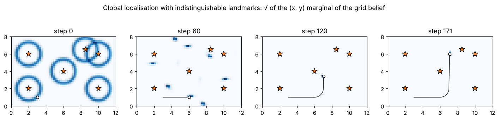

# 4 · The Bayes filter and grid localisation

Chapters 2 and 3 gave the two halves of every estimator: a motion model $p(x_k \mid x_{k-1}, u_k)$ and a
measurement model $p(z_k \mid x_k)$. The Bayes filter combines them recursively into the **belief**
$\operatorname{bel}(x_k) = p(x_k \mid z_{1:k}, u_{1:k})$. Every filter in the rest of the module — Kalman, extended
Kalman, particle — is the Bayes filter with a particular representation of the belief. This chapter derives it
and implements it in its most literal form: a probability for every cell of a grid.

Code: [`histogram_filter.hpp`](../cpp/include/state_estimation/histogram_filter.hpp) ·
Tests: [`test_histogram_filter.cpp`](../cpp/tests/test_histogram_filter.cpp) ·
Notebook: [`04_bayes_filter.ipynb`](../2_notebooks/solutions/04_bayes_filter.ipynb)

## 4.1 Derivation

Two assumptions make the problem recursive. The **Markov assumption** on the state: given $x_{k-1}$ and $u_k$,
$x_k$ is independent of everything earlier,

$$
p(x_k \mid x_{0:k-1}, z_{1:k-1}, u_{1:k}) = p(x_k \mid x_{k-1}, u_k), \tag{4.1}
$$

and **conditional independence of measurements**: given $x_k$, $z_k$ is independent of everything else,

$$
p(z_k \mid x_{0:k}, z_{1:k-1}, u_{1:k}) = p(z_k \mid x_k). \tag{4.2}
$$

*Correction.* Bayes' rule (1.12) applied to $z_k$, with everything else as background knowledge, and (4.2):

$$
\operatorname{bel}(x_k) = \eta\; p(z_k \mid x_k)\; p(x_k \mid z_{1:k-1}, u_{1:k}). \tag{4.3}
$$

*Prediction.* The second factor is the predicted belief $\overline{\operatorname{bel}}(x_k)$. The law of total
probability over $x_{k-1}$ and (4.1) give

$$
\overline{\operatorname{bel}}(x_k) = \int p(x_k \mid x_{k-1}, u_k)\; p(x_{k-1}\mid z_{1:k-1}, u_{1:k})\; dx_{k-1}. \tag{4.4}
$$

The control $u_k$ does not tell us anything about where the robot was *before* it executed $u_k$, so
$p(x_{k-1}\mid z_{1:k-1}, u_{1:k}) = \operatorname{bel}(x_{k-1})$. Together:

$$
\boxed{\;\overline{\operatorname{bel}}(x_k) = \int p(x_k \mid x_{k-1}, u_k)\,\operatorname{bel}(x_{k-1})\,dx_{k-1},\qquad
\operatorname{bel}(x_k) = \eta\, p(z_k\mid x_k)\,\overline{\operatorname{bel}}(x_k).\;} \tag{4.5}
$$

Prediction spreads the belief (a convolution with the motion noise); correction sharpens it (a product with the
likelihood). The integral in (4.5) has a closed form only in special cases — linear-Gaussian models give the
Kalman filter (chapter 5). Otherwise the belief must be approximated: by a grid (this chapter), a Gaussian
(chapter 6) or samples (chapter 7).

## 4.2 The discrete Bayes filter

If $x$ takes one of finitely many values $1, \dots, N$, the integral becomes a sum and the belief a vector:

$$
\bar b_k(i) = \sum_{j=1}^{N} p(x_k = i \mid x_{k-1} = j, u_k)\; b_{k-1}(j) \quad\Longleftrightarrow\quad \bar b_k = T_k\, b_{k-1}, \tag{4.6}
$$

$$
b_k(i) = \frac{p(z_k \mid x_k = i)\;\bar b_k(i)}{\sum_l p(z_k \mid x_k = l)\;\bar b_k(l)}. \tag{4.7}
$$

$T_k$ is column-stochastic (each column sums to one). The denominator of (4.7) is the evidence $p(z_k \mid z_{1:k-1})$,
which is useful on its own: a sudden drop means the measurement is surprising under the current belief. The
recursion is exactly the *forward algorithm* of hidden Markov models; the tests check it against brute-force
enumeration of all state sequences.

**Worked example — a corridor.** A robot moves in a cyclic corridor of 10 cells with doors at cells 1, 4 and 8.
A door detector reports "door" with probability $0.8$ in front of a door and $0.1$ in front of a wall. Starting
from a uniform belief:

1. *Reading "door"*: the evidence is $p(z) = 0.31$; each door cell gets $0.8/3.1 = 0.2581$, each wall cell
   $0.1/3.1 = 0.0323$. Three hypotheses remain.
2. *Move 3 cells* (2, 3 or 4 cells with probability $0.1, 0.8, 0.1$), *reading "door"*: only doors 1 and 8 have a
   door three cells further on (4 and, cyclically, 1). Cells 1 and 4 now hold $0.3902$ each — the belief is
   **bimodal**, which a single Gaussian could not represent.
3. *Move 3 cells, reading "wall"*: from 4 the robot reaches the wall at 7, from 1 the door at 4. Cell 7 becomes the
   most likely, with $0.4848$.

The numbers are computed by the tests and the notebook.

## 4.3 Grid localisation

For a planar pose the state space is continuous. **Grid localisation** (also called Markov localisation) divides
the map into cells of size $\Delta$ in $x$ and $y$ and $N_\theta$ heading intervals, and applies (4.6)–(4.7) to the
cells, each represented by its centre. A 10 m × 10 m map at $\Delta = 0.25$ m with $N_\theta = 36$ already has
57 600 cells.

**Prediction.** The exact sum (4.6) over all pairs of cells costs $O(N^2)$. The standard approximation splits the
odometry model (2.15)–(2.17) into a deterministic part and a noise part:

$$
\bar b_k = \mathcal G_{\sigma} * \operatorname{shift}_{u_k}(b_{k-1}). \tag{4.8}
$$

The shift moves the mass of each cell to the pose `apply_rtr(cell centre, u)` and splits it between the eight
neighbouring cells in proportion to the distance (trilinear weights), so that motions smaller than a cell are not
rounded away. The blur $\mathcal G_\sigma$ is a separable Gaussian convolution with standard deviations from
(2.17): $\sigma_{xy}^2 = \sigma_\text{trans}^2 + \delta_\text{trans}^2\sigma_\text{rot1}^2$ (translation noise plus
the lateral effect of the first rotation) and $\sigma_\theta^2 = \sigma_\text{rot1}^2 + \sigma_\text{rot2}^2$. Heading
is cyclic; mass that leaves the map is dropped and the belief renormalised. The cost is $O(N)$. The splitting itself
adds a variance of about $w(1-w)\Delta^2$ per step and axis ($w$ the fractional part of the move in cells), so on a
coarse grid the predicted belief is wider than the motion noise alone would make it — an artefact of the grid.

**Correction.** For each cell centre $c$ and each reading $z^i$ of landmark $c^i$,

$$
\log p(z_k \mid x = c) = \sum_i \log \mathcal N\big(z^i;\ h(c, m_{c^i}),\ R_\text{eff}\big). \tag{4.9}
$$

**Cell size matters.** The likelihood is evaluated at the cell *centre*, but the robot can be anywhere in the cell.
If the sensor is much sharper than the grid, the true cell can score low simply because its centre is 10 cm off.
Treating the position within the cell as uniform (variance $\Delta^2/12$ per axis, $\Delta_\theta^2/12$ in heading)
and propagating it to range and bearing inflates the noise:

$$
R_\text{eff} = R + \operatorname{diag}\!\Big(\frac{\Delta^2}{12},\ \frac{\Delta^2}{12\rho^2} + \frac{\Delta_\theta^2}{12}\Big). \tag{4.10}
$$

The notebook shows the failure without this term. Computing in the log domain and subtracting the maximum before
exponentiating avoids underflow when many readings are combined.

## 4.4 Global localisation and the kidnapped robot

A grid can represent any belief, including a uniform one: **global localisation** starts from
$b_0 = 1/N$ and lets the measurements carve out the hypotheses. With **indistinguishable** landmarks, the
likelihood of a reading is a mixture over all landmarks that could have produced it,

$$
p(z^i \mid x) = \frac{1}{n}\sum_{j=1}^{n} \mathcal N\big(z^i;\ h(x, m_j),\ R\big), \tag{4.11}
$$

and symmetric maps produce symmetric, multimodal beliefs that only motion past an asymmetric part of the map can
resolve. (With known correspondences — landmark identities — the symmetry is broken by the identities.)

If the robot is carried somewhere else without being told (**kidnapping**), the belief at the old pose is
confidently wrong and every cell near the true pose has probability (numerically) zero. A pure Bayes filter can only
move its belief as fast as the motion model spreads probability into neighbouring cells — it crawls towards the
truth, or, if the spread is truncated or the readings are ruled impossible, never gets there. The usual fix mixes in
a little uniform probability at each step,

$$
b_k \leftarrow (1-\varepsilon)\, b_k + \varepsilon / N, \tag{4.12}
$$

which keeps every cell alive at the price of slightly over-dispersed beliefs. Chapter 7 does the same with random
particles.

## Algorithm summary — grid localisation

1. Choose the grid ($\Delta$, $N_\theta$) so that a cell is not much larger than the sensor's spatial resolution.
2. Initialise: uniform (global) or a Gaussian around a known start.
3. For every odometry increment: shift each cell's mass by the deterministic motion with trilinear weights, blur with
   the odometry noise, renormalise (4.8).
4. For every scan: add the log-likelihoods (4.9) with the inflated noise (4.10); multiply in, renormalise.
5. Optionally mix with a uniform belief (4.12) to survive kidnapping.
6. Report the mean (circular mean for heading), the covariance or the most probable cell.

## Common mistakes

- Rounding each motion to the nearest cell: a robot moving 5 cm per step on a 25 cm grid never moves.
- Evaluating sharp likelihoods at cell centres without accounting for the cell size: the belief collapses onto the
  wrong cell or vanishes.
- Averaging headings arithmetically (the mean of $179°$ and $-179°$ is $180°$, not $0°$).
- Multiplying many small likelihoods in linear scale until they underflow to zero.
- Forgetting that a uniform prior over a large map plus a confident sensor gives a confident *multimodal* belief —
  its mean can be in a wall.

## References

- S. Thrun, W. Burgard, D. Fox, *Probabilistic Robotics*, MIT Press, 2005 — §2.4 (the Bayes filter), §4.1
  (the histogram filter), §8.2 (grid localisation), §8.3.
- W. Burgard, D. Fox, D. Hennig, T. Schmidt, "Estimating the absolute position of a mobile robot using position
  probability grids", *AAAI*, 1996.
- D. Fox, W. Burgard, S. Thrun, "Markov localization for mobile robots in dynamic environments", *Journal of
  Artificial Intelligence Research* 11, 1999.
- L. R. Rabiner, "A tutorial on hidden Markov models and selected applications in speech recognition",
  *Proceedings of the IEEE* 77(2), 1989 — the forward algorithm.
