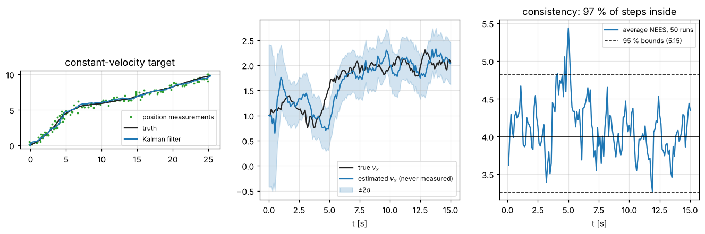

# 5 · The Kalman filter

When the motion and measurement models are linear and all noises are Gaussian, the Bayes filter (4.5) has an
exact, finite solution: the belief stays Gaussian forever, and its mean and covariance obey the Kalman filter. It
is the optimal estimator for this case — no other method, however clever, does better in mean squared error — and
the template for the extended Kalman filter (chapter 6) and EKF-SLAM (chapter 9). This chapter derives it, shows
how to check that a running filter is honest about its uncertainty (NEES and NIS), and how its gain settles.

Code: [`kalman_filter.hpp`](../cpp/include/state_estimation/kalman_filter.hpp) ·
Tests: [`test_kalman_filter.cpp`](../cpp/tests/test_kalman_filter.cpp) ·
Notebook: [`05_kalman_filter.ipynb`](../2_notebooks/solutions/05_kalman_filter.ipynb)

## 5.1 The linear-Gaussian model

$$
x_k = F_k\,x_{k-1} + B_k\,u_k + w_k, \qquad w_k \sim \mathcal N(0, Q_k), \tag{5.1}
$$

$$
z_k = H_k\,x_k + v_k, \qquad v_k \sim \mathcal N(0, R_k), \tag{5.2}
$$

with $x_0 \sim \mathcal N(\hat x_0, P_0)$ and $x_0$, $\{w_k\}$, $\{v_k\}$ mutually independent and white (independent
across time). Then every belief is Gaussian:

$$
\operatorname{bel}(x_k) = \mathcal N(\hat x_k, P_k), \qquad \overline{\operatorname{bel}}(x_k) = \mathcal N(\bar x_k, \bar P_k). \tag{5.3}
$$

## 5.2 Prediction

$x_k$ is a linear function of the independent Gaussians $x_{k-1}$ and $w_k$, so by (1.7):

$$
\bar x_k = F_k\hat x_{k-1} + B_k u_k, \tag{5.4}
$$

$$
\bar P_k = F_k P_{k-1} F_k^T + Q_k. \tag{5.5}
$$

## 5.3 Correction

Before $z_k$ is read, the state and the measurement are jointly Gaussian. Their means are $\bar x_k$ and
$H_k\bar x_k$; their covariances follow from (5.2) and the independence of $v_k$:

$$
\begin{bmatrix} x_k \\ z_k\end{bmatrix} \sim
\mathcal N\!\left(\begin{bmatrix}\bar x_k \\ H_k\bar x_k\end{bmatrix},\;
\begin{bmatrix}\bar P_k & \bar P_k H_k^T \\ H_k\bar P_k & H_k\bar P_kH_k^T + R_k\end{bmatrix}\right). \tag{5.6}
$$

For a jointly Gaussian pair $(a, b)$ the conditional $p(a\mid b)$ is Gaussian with mean
$\mu_a + \Sigma_{ab}\Sigma_{bb}^{-1}(b - \mu_b)$ and covariance $\Sigma_{aa} - \Sigma_{ab}\Sigma_{bb}^{-1}\Sigma_{ba}$ (the
Schur complement; complete the square in the exponent of the joint density). Conditioning (5.6) on the observed
$z_k$ is exactly Bayes' rule (4.5), and it gives the update. Name the pieces:

$$
\nu_k = z_k - H_k\bar x_k \qquad \text{(innovation)}, \tag{5.7}
$$

$$
S_k = H_k\bar P_kH_k^T + R_k \qquad \text{(innovation covariance)}, \tag{5.8}
$$

$$
K_k = \bar P_k H_k^T S_k^{-1} \qquad \text{(Kalman gain)}, \tag{5.9}
$$

$$
\hat x_k = \bar x_k + K_k\nu_k, \tag{5.10}
$$

$$
P_k = (I - K_kH_k)\,\bar P_k. \tag{5.11}
$$

The gain weighs the prediction against the measurement: when $R_k \to 0$, $K_kH_k \to I$ on the observed subspace
and the estimate follows the measurement; when $\bar P_k \to 0$, $K_k \to 0$ and the measurement is ignored. For
$H = 1$ the update is the fusion (1.20) of chapter 1: the tests check $\mathcal N(10, 4)$ updated with $z = 12$,
$R = 1$ gives $\hat x = 11.6$, $P = 0.8$.

**Why it is optimal.** Among all estimators that are functions of $z_{1:k}$, the conditional mean minimises the
mean squared error; for Gaussian models the conditional mean is (5.10). Without the Gaussian assumption the
same equations are still the best *linear* unbiased estimator. The tests check that sequential updates of a static
state reproduce the batch weighted least-squares solution exactly.

## 5.4 The Joseph form

For *any* gain $K$, the estimation error after the update is
$x_k - \hat x_k = (I - KH)(x_k - \bar x_k) - Kv_k$, a sum of two independent terms, so

$$
P_k = (I-KH)\,\bar P_k\,(I-KH)^T + K R K^T. \tag{5.12}
$$

Substituting the optimal gain (5.9) collapses (5.12) to (5.11). The difference matters in practice:

- (5.11) is only valid for the optimal $K$. If the gain is computed with a different $R$ (a deliberately
  de-weighted sensor, a gain held fixed, a gain from another filter), (5.11) reports a wrong covariance; (5.12)
  reports the true one. The tests verify both statements against Monte Carlo errors.
- (5.12) is a sum of two positive semi-definite terms and stays symmetric positive semi-definite under round-off;
  (5.11) is a difference in disguise and can lose positive definiteness.

The code always uses (5.12) and symmetrises.

## 5.5 Consistency: is the filter honest?

A filter is **consistent** if its errors are as large as its covariance says — no larger (over-confident), no
smaller (pessimistic). Two statistics test this.

**The innovation.** For a correct model, $\nu_k$ is zero-mean with covariance $S_k$ and independent across time
(white). Hence the normalised innovation squared

$$
\epsilon_{\nu,k} = \nu_k^T S_k^{-1}\nu_k \;\sim\; \chi^2_{m}, \qquad m = \dim z_k, \tag{5.13}
$$

and its expected value is $m$. NIS needs no ground truth, so it can be monitored on a real robot.

**The estimation error.** In simulation, where the true state is known,

$$
\epsilon_k = (x_k - \hat x_k)^T P_k^{-1}(x_k - \hat x_k) \;\sim\; \chi^2_n, \qquad n = \dim x_k. \tag{5.14}
$$

**Averaging over runs.** One value of $\epsilon_k$ is very noisy. Over $N$ independent Monte Carlo runs the sum
of the $N$ values at time $k$ is $\chi^2_{Nn}$, so the average must lie in

$$
\bar\epsilon_k \in \Big[\tfrac1N\chi^2_{Nn}(\tfrac\alpha2),\ \tfrac1N\chi^2_{Nn}(1 - \tfrac\alpha2)\Big] \tag{5.15}
$$

for a fraction $1-\alpha$ of the time steps. For $n = 2$, $N = 50$, $\alpha = 0.05$ the interval is
$[1.484, 2.591]$. Above the interval the filter is over-confident (its $P$ is too small, typically because $Q$ or $R$
is too small or the model is wrong); below, it is pessimistic. The same test applies to NIS with $m$ instead of $n$.
Do not average over time as if the steps were independent: consecutive errors are correlated, so a time average has
fewer effective degrees of freedom than its count suggests.

## 5.6 Steady state

If $F$, $H$, $Q$ and $R$ are constant, $\bar P_k$ obeys the **Riccati recursion**

$$
\bar P_{k+1} = F\big(\bar P_k - \bar P_kH^T(H\bar P_kH^T + R)^{-1}H\bar P_k\big)F^T + Q, \tag{5.16}
$$

which does not depend on the measurements. For a detectable and stabilisable system it converges to a unique
steady state from any $P_0$: the filter forgets its initialisation, and the gain becomes constant.

**Scalar example.** A random walk $x_k = x_{k-1} + w_k$ observed directly, with variances $q$ and $r$. In steady
state $\bar P = P + q$ and $P = \bar P r/(\bar P + r)$, so $\bar P^2 - q\bar P - qr = 0$ and

$$
\bar P_\infty = \frac{q + \sqrt{q^2 + 4qr}}{2}, \qquad K_\infty = \frac{\bar P_\infty}{\bar P_\infty + r}. \tag{5.17}
$$

For $q = 1$, $r = 4$: $\bar P_\infty = 2.5616$, $P_\infty = 1.5616$ and $K_\infty = 0.3904$. The gain depends only on
the ratio $q/r$: **tuning a Kalman filter means choosing that ratio** — how much you trust the model against the
sensor.

## 5.7 A model: constant velocity

To track a point whose motion is unknown, model its acceleration as white noise with spectral density $q$. Over a
sample $\Delta t$, integrating $\ddot p = a(t)$ gives, per axis with state $[p, v]$,

$$
F = \begin{bmatrix}1 & \Delta t\\ 0 & 1\end{bmatrix}, \qquad
Q = q\begin{bmatrix}\Delta t^3/3 & \Delta t^2/2 \\ \Delta t^2/2 & \Delta t\end{bmatrix}. \tag{5.18}
$$

The entries come from $\operatorname{Var}\big[\int_0^{\Delta t}(\Delta t - s)a(s)\,ds\big] = q\int_0^{\Delta t}(\Delta t-s)^2ds$
and similar integrals; the tests compare them with a fine numerical integration of white acceleration. The
notebook tracks such a target from position measurements, recovering its velocity, which is never measured.

## Algorithm summary

1. Initialise $\hat x_0$, $P_0$ (large $P_0$ if unknown).
2. Predict: $\bar x = F\hat x + Bu$, $\bar P = FPF^T + Q$.
3. Innovation $\nu = z - H\bar x$, $S = H\bar PH^T + R$; NIS $=\nu^TS^{-1}\nu$.
4. Gain $K = \bar PH^TS^{-1}$ (solve, do not invert).
5. $\hat x = \bar x + K\nu$; $P$ by the Joseph form (5.12); symmetrise.
6. Validate in simulation with NEES, on real data with NIS, both against (5.15).

## Common mistakes

- Using (5.11) with a gain that is not the optimal one.
- Inverting $S$ explicitly, or letting $P$ drift away from symmetry.
- Setting $Q = 0$ "because the model is exact": the gain goes to zero and the filter stops listening to the
  sensor — then any unmodelled change goes unnoticed (the notebook breaks a filter this way).
- Judging consistency from one run, or time-averaging NEES as if steps were independent.
- Forgetting that the noises must be white: a slowly varying bias in $v_k$ is not covered by $R$; add it to the
  state.

## References

- R. E. Kalman, "A new approach to linear filtering and prediction problems", *Journal of Basic Engineering* 82,
  1960.
- Y. Bar-Shalom, X. R. Li, T. Kirubarajan, *Estimation with Applications to Tracking and Navigation*, Wiley,
  2001 — ch. 5 (the Kalman filter, NEES/NIS consistency tests, §5.4), §6.2 (white-noise acceleration model).
- S. Thrun, W. Burgard, D. Fox, *Probabilistic Robotics*, MIT Press, 2005 — §3.2.
- D. Simon, *Optimal State Estimation*, Wiley, 2006 — ch. 5 (Joseph form, steady state).
- P. S. Maybeck, *Stochastic Models, Estimation, and Control*, vol. 1, Academic Press, 1979.
