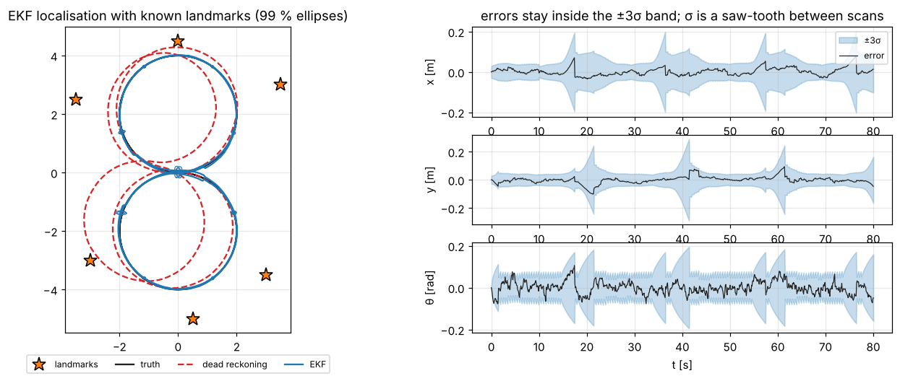

# 6 · The extended Kalman filter: map-based localisation

A robot's motion and its sensors are nonlinear — rotations everywhere — so the Kalman filter of chapter 5 does
not apply directly. The **extended Kalman filter** (EKF) linearises both models about the current estimate and
then runs the Kalman equations on the linearisation. This chapter derives it and uses it for the classic problem
of **map-based localisation**: a differential-drive robot with wheel odometry, observing point landmarks whose
positions are known, estimates its pose. It closes with what goes wrong when the linearisation is poor, and the
iterated EKF that repairs part of it.

Code: [`ekf.hpp`](../cpp/include/state_estimation/ekf.hpp) ·
Tests: [`test_ekf.cpp`](../cpp/tests/test_ekf.cpp) ·
Notebook: [`06_ekf_localization.ipynb`](../2_notebooks/solutions/06_ekf_localization.ipynb)

## 6.1 Nonlinear models

$$
x_k = f(x_{k-1}, u_k, w_k), \qquad w_k \sim \mathcal N(0, Q_k), \tag{6.1}
$$

$$
z_k = h(x_k) + v_k, \qquad v_k \sim \mathcal N(0, R_k). \tag{6.2}
$$

The noise enters $f$ through the control (wheel slip corrupts the measured displacement), which is why it appears
as an argument rather than added at the end.

## 6.2 Derivation

**Prediction.** Expand $f$ to first order about the previous estimate and zero noise,

$$
f(x_{k-1}, u_k, w_k) \approx f(\hat x_{k-1}, u_k, 0) + F_k(x_{k-1} - \hat x_{k-1}) + W_k w_k,\quad
F_k = \frac{\partial f}{\partial x}\Big\rvert_{\hat x_{k-1}},\ W_k = \frac{\partial f}{\partial w}\Big\rvert_{\hat x_{k-1}},
$$

which is affine in the Gaussian variables, so (1.7) gives

$$
\bar x_k = f(\hat x_{k-1}, u_k, 0), \tag{6.3}
$$

$$
\bar P_k = F_kP_{k-1}F_k^T + W_kQ_kW_k^T. \tag{6.4}
$$

The mean goes through the full nonlinear $f$; only the covariance uses the Jacobians.

**Correction.** Expand $h$ about the prediction, $h(x_k) \approx h(\bar x_k) + H_k(x_k - \bar x_k)$ with
$H_k = \partial h/\partial x\rvert_{\bar x_k}$. The measurement is then linear in $x_k$ with an offset, and the Kalman
update (5.7)–(5.12) applies with $H\bar x_k$ replaced by $h(\bar x_k)$:

$$
\nu_k = z_k - h(\bar x_k) \quad(\text{angular components wrapped}), \tag{6.5}
$$

$$
S_k = H_k\bar P_kH_k^T + R_k, \tag{6.6}
$$

$$
K_k = \bar P_kH_k^TS_k^{-1}, \tag{6.7}
$$

$$
\hat x_k = \bar x_k + K_k\nu_k, \tag{6.8}
$$

$$
P_k = (I - K_kH_k)\bar P_k(I - K_kH_k)^T + K_kR_kK_k^T. \tag{6.9}
$$

The EKF is not optimal and not even guaranteed to be consistent; it is exact for linear models (the tests check
that it reproduces the Kalman filter step by step) and good when the models are close to linear over the spread of
the belief.

## 6.3 Map-based localisation

The state is the pose $x_k = [x\;\,y\;\,\theta]^T$; the map $\{m_j\}$ is known and fixed.

**Prediction with odometry.** The encoders give a robot-frame displacement $u_k = \delta(s_k, \varphi_k)$ with
covariance $Q_k$ from (2.21). The motion model is the compounding of chapter 2, with the noise on the displacement:

$$
x_k = x_{k-1}\oplus(u_k + w_k),\qquad F_k = J_{1\oplus}(\hat x_{k-1}, u_k),\qquad W_k = J_{2\oplus}(\hat x_{k-1}, u_k). \tag{6.10}
$$

With no measurements this is exactly the dead reckoning of §2.6.

**Correction with landmarks.** A scan returns readings $z^1, \dots, z^n$ of landmarks $c^1, \dots, c^n$ (known
correspondences in this chapter; chapter 8 finds them). Stack them:

$$
z_k = \begin{bmatrix} z^1\\ \vdots\\ z^n\end{bmatrix},\quad
h(x) = \begin{bmatrix} h(x, m_{c^1})\\ \vdots\\ h(x, m_{c^n})\end{bmatrix},\quad
H_k = \begin{bmatrix} H_x(\bar x_k, m_{c^1})\\ \vdots\\ H_x(\bar x_k, m_{c^n})\end{bmatrix}, \tag{6.11}
$$

$$
R_k = \operatorname{diag}(R, \dots, R), \tag{6.12}
$$

with $h$ and $H_x$ the range–bearing model (3.4)–(3.5), and run one update. For independent readings this equals
processing them one by one *if* the Jacobians are not re-evaluated in between; re-linearising after each reading
(sequential updates) gives slightly different results. Cartesian feature readings use (3.9)–(3.10) in the same way:

$$
h(x, m) = R(\theta)^T(m - p),\qquad H_x \text{ from (3.10)}. \tag{6.13}
$$

A compass adds the row $H = [0\;0\;1]$ and a position fix the rows of (3.12); sensors with different rates are
simply updated when their readings arrive. Between landmark scans the covariance grows as in dead reckoning;
each scan pulls it back. The steady state of this saw-tooth depends on how often landmarks are seen, which the
notebook explores.

**Observability matters.** By §3.7, one range–bearing reading constrains two of the three pose directions. The
filter still works with one landmark at a time because the robot moves: readings of the same landmark from
different poses, or of different landmarks, eventually constrain everything.

## 6.4 When linearisation fails

The EKF's two approximations both break when the belief is wide compared with the curvature of the models:

- **Prediction.** With large heading uncertainty, the true distribution after a long move is the banana of §2.6;
  (6.4) replaces it with an ellipse that is too narrow along the arc.
- **Correction.** $H_k$ is evaluated at $\bar x_k$. If $\bar x_k$ is far from the truth — a large initial heading
  error, a robot that has dead-reckoned for a long time — the linearisation is wrong where it matters, the
  correction overshoots or points the wrong way, and $P_k$ shrinks anyway. The filter becomes **over-confident**: its
  NEES leaves the $\chi^2$ bounds and it may not recover.

The symptom in practice is NIS far above its expected value right after a large correction. The notebook measures
the effect: the robot drives 3 m with an uncertain initial heading and then sees two landmarks. As the heading
standard deviation grows from a few degrees to tens of degrees, the average NEES after the correction climbs from
its consistent value of 3 to the hundreds.

## 6.5 The iterated EKF

The EKF update is one Gauss–Newton step on the MAP cost
$\lVert x - \bar x\rVert^2_{\bar P^{-1}} + \lVert z - h(x)\rVert^2_{R^{-1}}$, linearised at $\bar x$. The **iterated
EKF** takes more steps, re-linearising at each iterate $x^{(i)}$:

$$
H^{(i)} = \frac{\partial h}{\partial x}\Big\rvert_{x^{(i)}},\quad K^{(i)} = \bar PH^{(i)T}\big(H^{(i)}\bar PH^{(i)T}+R\big)^{-1},\quad
x^{(i+1)} = \bar x + K^{(i)}\big(z - h(x^{(i)}) - H^{(i)}(\bar x - x^{(i)})\big), \tag{6.14}
$$

starting from $x^{(0)} = \bar x$; the first iterate is the EKF update. At convergence $x^{(i)}$ is the MAP estimate
(the tests compare it with a brute-force minimisation for $z = x^2 + v$), and the covariance is evaluated with the
final $K$ and $H$. It costs a few extra evaluations of $h$ and fixes the correction step; it does nothing for the
prediction.

## Algorithm summary — EKF localisation

1. Initialise $\hat x_0$, $P_0$ honestly (a wrong but confident start is the worst case).
2. For each odometry reading: $u$ and $Q$ from the wheels (2.9)–(2.21); $F = J_{1\oplus}$, $W = J_{2\oplus}$ at
   the old estimate; $\bar x = \hat x\oplus u$, $\bar P = FPF^T + WQW^T$.
3. For each scan: predicted readings and Jacobians for every observed landmark, stacked; wrapped innovation;
   $S$, $K$, update with the Joseph form; wrap the heading.
4. Other sensors (compass, position fix) whenever they report.
5. Monitor NIS; in simulation, NEES.

## Common mistakes

- Evaluating $F$ and $W$ at the new mean, or $H$ before the prediction.
- Not wrapping the bearing innovation, or the heading after the update.
- Using $Q$ in the robot frame without $W_k$ (the robot-frame displacement noise must be rotated into the world).
- Starting with a small $P_0$ and a wrong $\hat x_0$: the filter trusts its prior and ignores the landmarks.
- Treating a correction that drives NIS to hundreds as normal; it is a symptom of linearisation failure or a wrong
  data association.

## References

- S. Thrun, W. Burgard, D. Fox, *Probabilistic Robotics*, MIT Press, 2005 — §3.3 (EKF), §7.4 (EKF localisation).
- R. Smith, M. Self, P. Cheeseman, "Estimating uncertain spatial relationships in robotics", 1990.
- J. A. Castellanos, J. D. Tardós, *Mobile Robot Localization and Map Building*, Kluwer, 1999.
- B. M. Bell, F. W. Cathey, "The iterated Kalman filter update as a Gauss–Newton method", *IEEE Trans. Automatic
  Control* 38(2), 1993.
- Y. Bar-Shalom, X. R. Li, T. Kirubarajan, *Estimation with Applications to Tracking and Navigation*, 2001 —
  §10.3 (EKF), §10.5 (iterated EKF).
