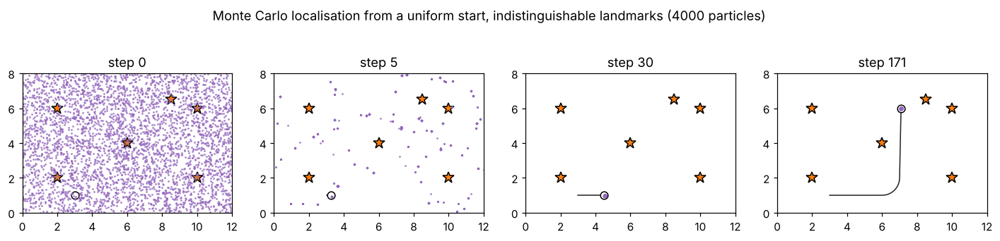

# 7 · The particle filter

The Kalman family represents the belief by a single Gaussian. When the belief is multimodal (global localisation,
symmetric environments), strongly non-Gaussian (a banana after a long dead-reckoning run), or the models are too
nonlinear to linearise, a different representation is needed. The **particle filter** represents the belief by a
set of samples — particles — and implements the Bayes filter (4.5) by simulation: move every particle with the
motion model, weight it by how well it explains the measurement, and resample. Applied to localisation it is
called **Monte Carlo localisation** (MCL).

Code: [`particle_filter.hpp`](../cpp/include/state_estimation/particle_filter.hpp) ·
Tests: [`test_particle_filter.cpp`](../cpp/tests/test_particle_filter.cpp) ·
Notebook: [`07_particle_filter.ipynb`](../2_notebooks/solutions/07_particle_filter.ipynb)

## 7.1 Beliefs as weighted samples

A set of $M$ particles $x^{[i]}$ with normalised weights $w^{[i]}$ represents the belief

$$
\operatorname{bel}(x_k) \approx \sum_{i=1}^{M} w^{[i]}_k\,\delta\big(x_k - x^{[i]}_k\big), \tag{7.1}
$$

in the sense that expectations become weighted averages, $E[g(x)] \approx \sum_i w^{[i]} g(x^{[i]})$, with an error that
shrinks as $1/\sqrt{M}$ regardless of the shape of the belief.

## 7.2 Importance sampling

We usually cannot sample the posterior $p$ directly, but we can sample a **proposal** $q$ and correct:

$$
E_p[g(x)] = \int g(x)\frac{p(x)}{q(x)}q(x)\,dx = E_q\!\left[g(x)\,\frac{p(x)}{q(x)}\right]. \tag{7.2}
$$

Draw $x^{[i]} \sim q$ and give each the weight $w^{[i]} \propto p(x^{[i]})/q(x^{[i]})$, normalised to sum to one
(the normalisation removes the unknown constant $\eta$ of Bayes' rule):

$$
E_p[g(x)] \approx \sum_i w^{[i]}g(x^{[i]}),\qquad w^{[i]} = \frac{p(x^{[i]})/q(x^{[i]})}{\sum_j p(x^{[j]})/q(x^{[j]})}. \tag{7.3}
$$

The estimate is good when $q$ puts samples where $p$ has mass; it needs $q > 0$ wherever $p > 0$.

## 7.3 Sequential importance sampling and the bootstrap filter

Apply (7.3) to whole trajectories. The posterior factorises by the Markov assumptions,
$p(x_{0:k}\mid z_{1:k}) \propto p(z_k\mid x_k)\,p(x_k\mid x_{k-1}, u_k)\,p(x_{0:k-1}\mid z_{1:k-1})$, so if each particle
extends its trajectory by sampling $x_k^{[i]} \sim q(x_k\mid x_{k-1}^{[i]}, z_k, u_k)$, its weight updates recursively:

$$
w_k^{[i]} \;\propto\; w_{k-1}^{[i]}\;\frac{p(z_k\mid x_k^{[i]})\;p(x_k^{[i]}\mid x_{k-1}^{[i]}, u_k)}{q(x_k^{[i]}\mid x_{k-1}^{[i]}, z_k, u_k)}. \tag{7.4}
$$

The simplest proposal is the motion model itself, $q = p(x_k\mid x_{k-1}, u_k)$. The motion terms cancel:

$$
x_k^{[i]} \sim p(x_k\mid x_{k-1}^{[i]}, u_k), \qquad w_k^{[i]} \propto w_{k-1}^{[i]}\;p(z_k\mid x_k^{[i]}). \tag{7.5}
$$

This **bootstrap filter** needs only a way to *sample* the motion model (chapter 2) and to *evaluate* the measurement
likelihood (chapter 3). Its weakness is that the proposal ignores $z_k$: if the likelihood is much narrower than the
predicted cloud, few particles land where it is large.

## 7.4 Degeneracy and resampling

The weights in (7.4) are products of many factors. Their variance can only grow (Kong et al., 1994): after a few
steps one particle carries almost all the weight and the rest are wasted computation. The **effective sample size**

$$
N_\text{eff} = \frac{M}{1 + \operatorname{Var}_q\!\big[M\,w\big]} \tag{7.6}
$$

is estimated from the normalised weights by

$$
\hat N_\text{eff} = \frac{1}{\sum_i \big(w^{[i]}\big)^2}, \tag{7.7}
$$

which is $M$ for equal weights and $1$ when a single particle has all the weight. **Resampling** draws $M$ new
particles from the weighted set, with replacement, so that particle $i$ is copied $N_i$ times with
$E[N_i] = Mw^{[i]}$, and resets all weights to $1/M$. It discards hopeless particles and multiplies good ones. It also
adds noise — it is a random operation — so it is done only when needed, typically when $\hat N_\text{eff} < M/2$.

Four schemes produce unbiased copy counts; they differ in variance and cost. With the cumulative weights
$c_j = \sum_{i\le j} w^{[i]}$, each scheme chooses $M$ pointers $u_1, \dots, u_M \in [0, 1)$ and copies the particle
$j$ with $c_{j-1} \le u < c_j$:

- **Multinomial** (the roulette wheel): $M$ independent pointers,
  $$u_m \sim \mathcal U[0, 1), \qquad \operatorname{Var}[N_i] = Mw^{[i]}(1-w^{[i]}). \tag{7.8}$$
  Each pointer is located by binary search: $O(M\log M)$.
- **Stratified**: one pointer in each stratum,
  $$u_m = \frac{m - 1 + \tilde u_m}{M},\quad \tilde u_m \sim \mathcal U[0,1)\ \text{independent}. \tag{7.9}$$
- **Systematic** (stochastic universal sampling): a single random offset,
  $$u_m = \frac{m - 1 + \tilde u}{M},\quad \tilde u \sim \mathcal U[0, 1). \tag{7.10}$$
  Sorted pointers are matched in one sweep: $O(M)$. Particle $i$ is copied either $\lfloor Mw^{[i]}\rfloor$ or
  $\lceil Mw^{[i]}\rceil$ times — the least random choice possible.
- **Residual**: copy $\lfloor Mw^{[i]}\rfloor$ times deterministically, then draw the remaining
  $M - \sum_i\lfloor Mw^{[i]}\rfloor$ multinomially from the residual weights
  $$\tilde w^{[i]} \propto Mw^{[i]} - \lfloor Mw^{[i]}\rfloor. \tag{7.11}$$

| scheme | randomness | cost | copies of particle $i$ |
|---|---|---|---|
| multinomial | highest | $O(M\log M)$ | any number |
| stratified | lower | $O(M)$ | — |
| systematic | lowest | $O(M)$ | $\lfloor Mw\rfloor$ or $\lceil Mw\rceil$ |
| residual | low | $O(M)$ + multinomial remainder | $\ge \lfloor Mw\rfloor$ |

The tests check unbiasedness of all four, the variance of the multinomial counts, and the floor/ceil guarantees.
Systematic resampling is the usual default.

## 7.5 Monte Carlo localisation

For a planar pose with wheel odometry and range–bearing readings of known landmarks:

**Prediction.** For each particle, draw its own version of the encoder errors and drive it:

$$
\tilde d_{l,r}^{[i]} = d_{l,r} + \varepsilon^{[i]}_{l,r},\ \ \varepsilon \sim \mathcal N(0, k\lvert d\rvert),\qquad
x_k^{[i]} = x_{k-1}^{[i]}\oplus\delta\big(s(\tilde d^{[i]}), \varphi(\tilde d^{[i]})\big). \tag{7.12}
$$

This samples the exact (nonlinear) motion model; the cloud bends into the banana that the EKF approximates by an
ellipse. The odometry model of §2.5 can be used instead.

**Weighting.** For readings $z^i$ of landmarks $c^i$, in the log domain to avoid underflow,

$$
\log w_k^{[i]} = \log w_{k-1}^{[i]} + \sum_j \log\mathcal N\big(z^j;\ h(x_k^{[i]}, m_{c^j}),\ R\big) + \text{const}. \tag{7.13}
$$

With indistinguishable landmarks the per-reading likelihood is the mixture (4.11), and MCL — like the grid filter —
handles the resulting multimodal belief without any change.

**Estimates.** The weighted mean (circular for the heading) and covariance summarise a unimodal cloud; for a
multimodal one they can be meaningless (the mean of two hypotheses lies between them), and a mode or a cluster
should be reported instead.

## 7.6 Particle deprivation and recovery

Resampling makes copies; motion noise spreads them again. With finite $M$, regions of the state space can end up with
no particle at all — **particle deprivation**. Typical causes and remedies:

- *Too few particles for the uncertainty.* Global localisation in a large map needs many more particles than
  tracking. Adaptive schemes (KLD sampling) choose $M$ on line.
- *A likelihood much sharper than the motion noise.* Almost every particle gets weight zero; $\hat N_\text{eff}$
  collapses to one or two. Remedies: more particles, a slightly inflated $R$ (a common, deliberate approximation),
  or a proposal that looks at $z_k$.
- *Resampling too often.* Each resampling loses diversity; resample only when $\hat N_\text{eff}$ is low.
- *Kidnapping.* If no particle is near the new pose, the filter cannot recover by itself. **Augmented MCL** tracks
  short- and long-term averages of the measurement likelihood $\bar w_k = p(z_k\mid z_{1:k-1})$,
  $$
  w_\text{slow} \leftarrow w_\text{slow} + \alpha_\text{slow}(\bar w_k - w_\text{slow}),\quad
  w_\text{fast} \leftarrow w_\text{fast} + \alpha_\text{fast}(\bar w_k - w_\text{fast}),\quad
  p_\text{inject} = \max\!\Big(0,\ 1 - \frac{w_\text{fast}}{w_\text{slow}}\Big), \tag{7.14}
  $$
  with $0 < \alpha_\text{slow} \ll \alpha_\text{fast}$. When the measurements suddenly fit worse than they used to,
  a fraction $p_\text{inject}$ of the particles is replaced by random poses — the particle analogue of the uniform
  mixing (4.12) of the grid filter. Right after a kidnapping $p_\text{inject}$ approaches one, and replacing almost
  every particle at every update keeps the filter from ever accumulating evidence for the new pose; capping the
  injected fraction (the code takes a `max_fraction`, e.g. 0.1) lets the few lucky random particles multiply. While
  random particles are present, report the cluster around the best particle rather than the overall mean.

## Algorithm summary — MCL

1. Draw $M$ particles from the initial belief (uniform for global localisation).
2. For each odometry reading, move every particle with its own noise sample (7.12).
3. For each scan, add the log-likelihood (7.13) to every particle's log-weight; subtract the maximum.
4. If $\hat N_\text{eff} < M/2$: systematic resampling, weights reset to $1/M$; optionally inject random particles (7.14).
5. Report the weighted mean and covariance (or the best cluster).

## Common mistakes

- Resampling after every step regardless of $\hat N_\text{eff}$.
- Moving all particles with the same noise sample (that is dead reckoning $M$ times).
- Multiplying likelihoods in linear scale until they underflow.
- Averaging headings arithmetically.
- Using too few particles for global localisation and blaming the algorithm.
- Reporting the mean of a multimodal particle set.

## References

- S. Thrun, W. Burgard, D. Fox, *Probabilistic Robotics*, MIT Press, 2005 — §4.3 (particle filter), §4.3.4
  (resampling), §8.3 (MCL), table 8.3 (augmented MCL).
- F. Dellaert, D. Fox, W. Burgard, S. Thrun, "Monte Carlo localization for mobile robots", *ICRA*, 1999.
- N. J. Gordon, D. J. Salmond, A. F. M. Smith, "Novel approach to nonlinear/non-Gaussian Bayesian state estimation",
  *IEE Proceedings F* 140(2), 1993 — the bootstrap filter.
- A. Doucet, A. M. Johansen, "A tutorial on particle filtering and smoothing: fifteen years later", in *Handbook of
  Nonlinear Filtering*, OUP, 2011.
- R. Douc, O. Cappé, "Comparison of resampling schemes for particle filtering", *ISPA*, 2005.
- A. Kong, J. S. Liu, W. H. Wong, "Sequential imputations and Bayesian missing data problems", *JASA* 89, 1994.
- D. Fox, "Adapting the sample size in particle filters through KLD-sampling", *IJRR* 22(12), 2003.
