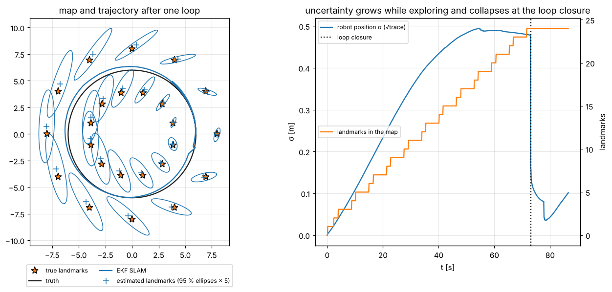

# 9 · Feature-based EKF SLAM

In chapter 6 the map was given. In **simultaneous localisation and mapping** (SLAM) it is not: the robot must build
the map from the same noisy readings it uses to localise against it. The classic solution keeps the robot pose
*and* all landmark positions in one Gaussian state and runs an EKF on it. Its central lesson is in the covariance:
landmarks observed from the same uncertain robot become correlated, and those correlations are what let the map
improve as a whole and let a loop closure correct the entire trajectory.

Code: [`ekf_slam.hpp`](../cpp/include/state_estimation/ekf_slam.hpp) ·
Tests: [`test_ekf_slam.cpp`](../cpp/tests/test_ekf_slam.cpp) ·
Notebook: [`09_ekf_slam.ipynb`](../2_notebooks/solutions/09_ekf_slam.ipynb)

## 9.1 The state

$$
y_k = \begin{bmatrix} x_k \\ m_1 \\ \vdots \\ m_n\end{bmatrix},\qquad
P_k = \begin{bmatrix} P_{xx} & P_{xm_1} & \cdots & P_{xm_n}\\ P_{m_1x} & P_{m_1m_1} & \cdots & P_{m_1m_n}\\ \vdots & & \ddots & \vdots\\
P_{m_nx} & P_{m_nm_1} & \cdots & P_{m_nm_n}\end{bmatrix}. \tag{9.1}
$$

The filter estimates the joint posterior of pose and map,

$$
p(x_k, m_1, \dots, m_n \mid z_{1:k}, u_{1:k}) \approx \mathcal N(\hat y_k, P_k). \tag{9.2}
$$

The diagonal blocks are the uncertainty of the robot and of each landmark; the off-diagonal blocks are their
correlations. The dimension grows by two with each landmark.

## 9.2 Prediction

Landmarks do not move, so only the robot part of the state changes: $x_k = x_{k-1}\oplus u_k$ and $m_i$ unchanged. The
Jacobians of the full motion model are $F_y = \operatorname{diag}(F, I)$ and $W_y = [W^T\; 0]^T$ with $F = J_{1\oplus}$,
$W = J_{2\oplus}$ as in (6.10), so

$$
\bar y_k = \begin{bmatrix}\hat x_{k-1}\oplus u_k\\ \hat m\end{bmatrix}, \tag{9.3}
$$

$$
\bar P_{xx} = FP_{xx}F^T + WQW^T,\qquad \bar P_{xm} = FP_{xm},\qquad \bar P_{mm} = P_{mm}. \tag{9.4}
$$

Writing (9.4) block by block costs $O(n)$ instead of the $O(n^3)$ of multiplying full matrices.

## 9.3 Adding a landmark: state augmentation

A reading $z$ of a landmark not yet in the state is turned into a position with the inverse model (3.6),

$$
m_{n+1} = g(x_k, z), \tag{9.5}
$$

and appended to the state:

$$
y^+ = \begin{bmatrix} y\\ g(\hat x, z)\end{bmatrix}. \tag{9.6}
$$

The new covariance follows from linearising $g$ in the robot pose and the reading noise, with $G_x$, $G_z$ from (3.7) and
$G_y = [G_x\; 0\; \cdots\; 0]$ the Jacobian with respect to the whole state:

$$
P^+ = \begin{bmatrix} P & P\,G_y^T \\ G_y P & G_xP_{xx}G_x^T + G_zRG_z^T\end{bmatrix}. \tag{9.7}
$$

The new landmark's uncertainty contains the robot's own uncertainty projected through the lever arm, and its
cross-covariance $G_yP$ ties it to the robot *and* to every landmark the robot is correlated with. Dropping those
cross terms — initialising the landmark as independent — is the most common EKF-SLAM bug: the filter then believes
it has information it does not have and becomes over-confident. The tests compare (9.7) with Monte Carlo samples of
$[x;\ g(x, z+v)]$; they also show that the augmented *mean* $g(\hat x, z)$ is biased by about $\rho\,\sigma_\theta^2/2$
towards the robot — the banana of chapter 1 again.

**A priori known landmarks** enter the state with their given covariance and no correlation; with zero covariance,
EKF SLAM reduces exactly to the map-based localisation of chapter 6 (checked in the tests).

## 9.4 Update

A reading of landmark $i$ depends only on the robot and on that landmark, so its Jacobian is sparse:

$$
H_i = \begin{bmatrix} H_x & 0 & \cdots & 0 & H_{m} & 0 & \cdots & 0\end{bmatrix}, \tag{9.8}
$$

with $H_x$, $H_m$ the range–bearing Jacobians (3.5) in the robot columns and the two columns of landmark $i$. Stacking
the readings of a scan, the update is the ordinary EKF update (6.5)–(6.9) on the full state:

$$
S = H\bar PH^T + R,\quad K = \bar PH^TS^{-1},\quad \hat y = \bar y + K\nu,\quad P = (I-KH)\bar P(I-KH)^T + KRK^T. \tag{9.9}
$$

$K$ is dense: through the correlations, a reading of one landmark corrects the robot and **every** landmark. The
update costs $O(n^2)$ per reading (the $n\times n$ covariance is touched), which limits EKF SLAM to a few hundred
landmarks.

**Order within a scan.** Readings of known landmarks update the state first; unknown ones are added afterwards, from
the corrected pose (Algorithm: predict → associate → update → augment).

## 9.5 Association in SLAM

With identifiers (fiducials, or the simulator's labels) association is trivial. Without them, JCBB (chapter 8) runs
against all landmarks in the state with the full $H_i$ of (9.8). SLAM adds a twist: an unpaired reading creates a
landmark. A correct pairing rejected by the gate — which happens a fraction $\alpha$ of the time by construction — would
duplicate an existing landmark. The usual remedy is a **second, much wider gate**: an unpaired reading creates a
landmark only if it is incompatible with every existing landmark even at confidence $1 - \alpha_\text{new}$
($\alpha_\text{new} \ll \alpha$, e.g. $10^{-4}$); readings in between are ambiguous and dropped. The tests check that
this reproduces the true correspondences without duplicates.

## 9.6 How the uncertainty behaves

Dissanayake et al. (2001) proved three properties of the linear(ised) SLAM filter:

1. **The uncertainty of any landmark (and of any set of landmarks) never increases**: the determinant of every
   sub-matrix of the map covariance is non-increasing. Prediction does not touch $P_{mm}$, and updates only remove
   uncertainty.
2. **In the limit the landmarks become fully correlated**: their relative positions become known exactly.
3. **The absolute uncertainty of the map has a lower bound** set by the robot's uncertainty when the first landmark was
   added: the map can never be located better than the robot was at the start.

Property 1 and the consequences of 2 and 3 are checked in the tests: landmark determinants never grow, the relative
position of two landmarks is known much better than either absolute position, and no landmark ends with less
uncertainty than the initial robot position.

**Loop closure.** Driving away, the robot accumulates uncertainty, and so do the landmarks it adds. When it re-observes a
landmark mapped at the start of the loop — well known, and correlated with the robot's early poses — the update corrects
the robot, and through the correlations every landmark of the loop collapses at once. The figure shows the robot's
uncertainty drop at the loop closure.

## 9.7 Inconsistency

EKF SLAM is not consistent over long runs. The Jacobians are evaluated at the current estimates, and the heading
estimate keeps changing; as a result the filter gains information along a direction that is in truth unobservable
(the global orientation of the map), and its covariance shrinks faster than its errors (Julier and Uhlmann, 2001;
Castellanos et al., 2004; Huang et al., 2010). The NEES of the robot pose drifts upwards over long trajectories with
large heading uncertainty — the notebook measures it. Remedies are the observability-constrained EKF, submapping, and
moving to optimisation-based SLAM (chapter 10), which re-linearises the whole trajectory.

## Algorithm summary — EKF SLAM

1. Initialise $y = x_0$, $P = P_0$ (often $P_0 = 0$: the map frame is the starting pose).
2. Predict the robot with odometry; update only the robot rows and columns (9.4).
3. Associate the scan with the landmarks in the state (identifiers or JCBB on the full $H$).
4. Update with all paired readings at once (9.8)–(9.9); wrap the heading.
5. Add each unpaired reading that passes the new-landmark gate with (9.5)–(9.7), from the updated pose.

## Common mistakes

- Initialising a new landmark without its cross-covariance with the robot and the map.
- Updating the full covariance in the prediction with dense matrices (correct but $O(n^3)$).
- Adding landmarks before updating with the known ones in the same scan.
- Letting every rejected pairing create a landmark: duplicates.
- Reading the absolute landmark uncertainty as map quality — the relative uncertainty is what improves.
- Trusting the covariance of a long EKF-SLAM run: it is optimistic.

## References

- R. Smith, M. Self, P. Cheeseman, "Estimating uncertain spatial relationships in robotics", 1990.
- M. W. M. G. Dissanayake, P. Newman, S. Clark, H. F. Durrant-Whyte, M. Csorba, "A solution to the simultaneous
  localization and map building (SLAM) problem", *IEEE Trans. Robotics and Automation* 17(3), 2001.
- S. Thrun, W. Burgard, D. Fox, *Probabilistic Robotics*, MIT Press, 2005 — ch. 10 (EKF SLAM).
- H. Durrant-Whyte, T. Bailey, "Simultaneous localisation and mapping: part I", *IEEE Robotics & Automation Magazine*
  13(2), 2006.
- S. J. Julier, J. K. Uhlmann, "A counter example to the theory of simultaneous localization and map building",
  *ICRA*, 2001.
- J. A. Castellanos, J. Neira, J. D. Tardós, "Limits to the consistency of EKF-based SLAM", *IFAC IAV*, 2004.
- G. P. Huang, A. I. Mourikis, S. I. Roumeliotis, "Observability-based rules for designing consistent EKF SLAM
  estimators", *IJRR* 29(5), 2010.
